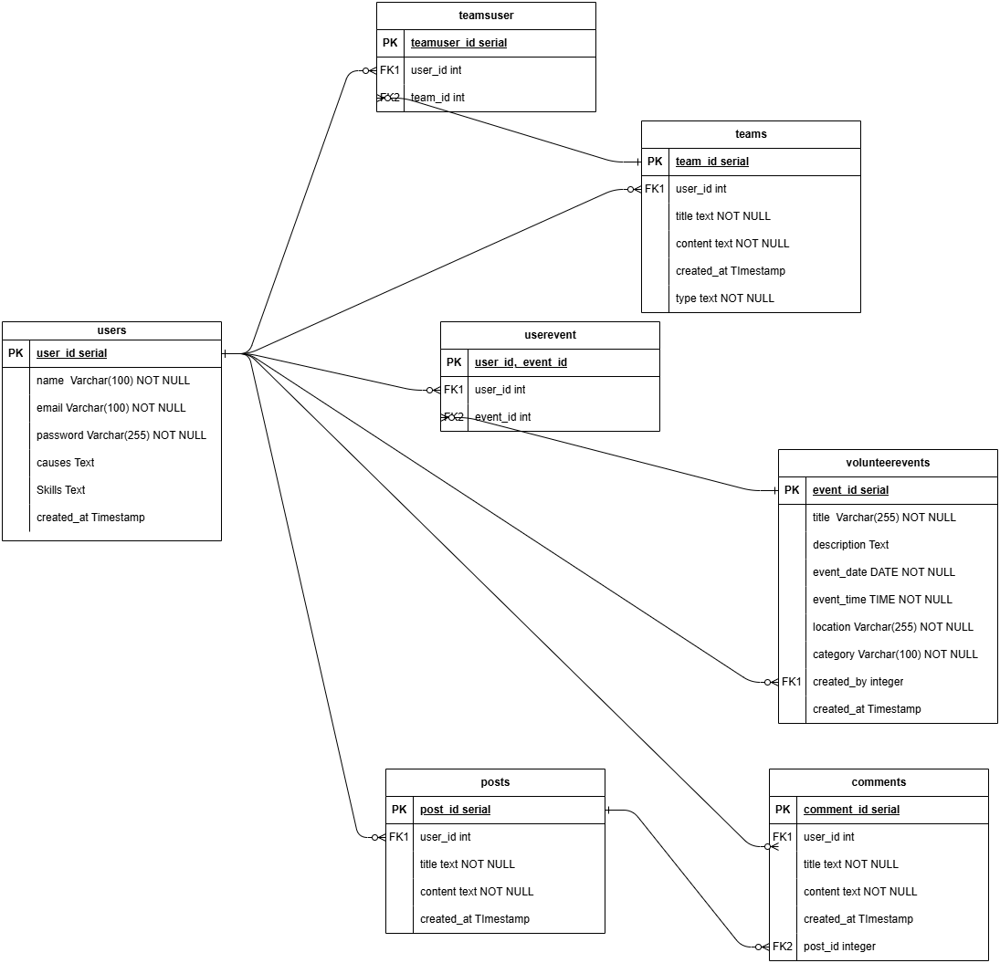

# HandsOn - A Community-Driven Social Volunteering Platform

## 📖 Project Description

HandsOn is a community-driven social volunteering platform that connects individuals with meaningful social impact opportunities. Users can discover and join volunteer-driven events, post requests for community help, form teams for large-scale initiatives.

## 🔧 Tech Stack

- **Frontend:** React.js (Vite, Tailwind CSS)
- **Backend:** Node.js (Express.js)
- **Database:** PostgreSQL
- **Authentication:** JWT-based auth
- **API Communication:** REST API

## 🎯 Features

1. **User Registration & Profile Management**

   - Secure sign-up and login with email & password.
   - User profiles with skills, supported causes
   - Editable profiles

2. **Discover & Join Volunteer Events**

   - Users or organizations can create volunteer events.
   - Public event feed with category, location, and availability filters.
   - One-click event registration.
   - Differentiation between scheduled events and ongoing community help posts.

3. **Community Help Requests**

   - Users can post help requests.
   - Other users can offer help via comments or private messaging.
   - Requests are prioritized by urgency levels.

4. **Form Teams & Group Initiatives**

   - Users can form teams for long-term initiatives.
   - Private teams (invite-only) and public teams (open participation).
   - Team dashboards with members
   - Leaderboard for most active teams.

## 🗂 Database Schema



## 🛠 Setup Instructions

### Prerequisites

Ensure you have the following installed:

- Node.js & npm
- PostgreSQL

### Installation

```bash
git clone https://github.com/gourab1904113/VolounteeringPlatform.git
cd VOLOUNTEER


or Download Zip folder
cd .\VolounteeringPlatform-main\
npm run dev

#create new terminal

cd .\VolounteeringPlatform-main\
cd .\frontend\
npm install
npm run dev

```
